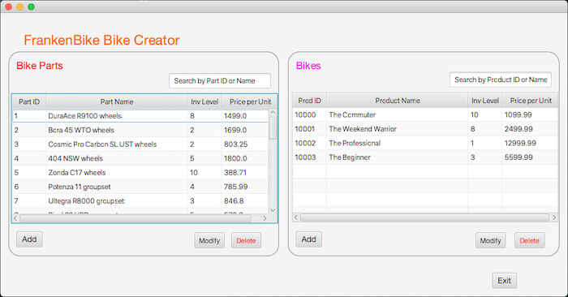

# FrankenBike
**FrankenBike** is a Java application that allows a bike shop
to purchase and enter a variety of parts to the shop's database.
Once the parts are in the shop and entered into the database, they
can be combined to create bikes in an unlimited amount of combinations.
These custom bikes can then be configured right on the database and
given a name, ready to be sold to an eager custom bike enthusiast.

## User Interface

**FrankenBike**'s main screen is a simple display of both individual
bike parts and completed (assembled) "frankenbikes". 
