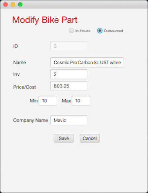
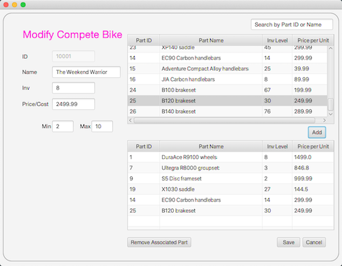

# FrankenBike
**FrankenBike** was written as part of a WGU course on Java Development.
This app allows a bike shop to purchase and enter a variety of parts to the 
shop's database. Once the parts are in the shop and entered into the database, 
they can be combined to create bikes in an unlimited amount of combinations.
These custom bikes can then be configured right on the database and
given a name, ready to be sold to an eager custom bike enthusiast.

## User Interface

**FrankenBike**'s main screen is a simple display of both individual
bike parts and completed (assembled) "frankenbikes". Each item on
the lists is clickable and allows the user to drill down into
adding, modifying, and/or deleting bike parts or completed bikes.

 

### Installation & Code Style
**FrankenBike** is a Java app repository and there is no APK.
This application uses the MVC design pattern, storing all data
locally. The database is instantiated and manipulated in the Inventory 
Entity using a series of ObservableLists. The Main InventoryProgram loads 
the basic set of data entries (parts and bikes) and deletes all data with 
each restart for a fresh data set. 

